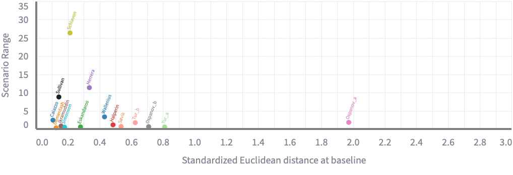

# Data-driven visualisation tool to guide sensitivity analysis for Randomised Controlled Trial evidence synthesis

## Motivation
Increasingly, randomisation to a treatment or placebo is being used for instrumental variable (IV) analysis in Randomized Controlled Trials (RCTs) for evidence triangulation.
In our applied example of triangulating Mendelian randomisation (Mr) and RCTs evidence, we noted a high level of heterogeneity among surgical trials in which we were synthesising evidence. Our main assumption is that randomisation ought to be done correctly so that we can use it as an IV instrument. Variables of interest that would be useful for metaregression analysis are poorly reported across the studies, a good example being antihypertensive drug use for participants with hypertension. As a result, we envisioned visualising the baseline characteristics. Specifically the exposure and the outcome, which is our key measure to compute the estimand of interest, would provide interesting findings to guide researchers with further work.

Despite RCTs reporting in the publications that randomisation was done, we have observed many differences within and between studies. 
We acknowledge that bias could arise from so many other areas, not just failed randomisation. 

## Relevance
However, we aim to provide a data-driven visualisation approach that will help other researchers make careful considerations about whether to progress with metaanalysis and will also be useful in guiding sensitivity analysis.

##  Implementation
We used Pandas for data wrangling and altair for visualisation.
We have implemented the code and deployed it as a web app using streamlit v1.36.0, where the data is provided side by side with the visualisations showing the baseline measures for the treatment arms.
We have provided the data from our work for reproducibility.
We have deposited all scripts that we used in this repository, including the Jupyter Notebook and streamlit web app. 
The figures we generated are also in the repo. However, they are available in the app.

## Software
NB: Use the latest versions of the software.

`Pandas v2.2.2`

`Altair v5.3.0`

`Streamlit v1.36.0`

`Python 3.12.0`

`Jupyter Notebook or jupyter lab`

## Usage

#### Web
Use the link here to access the deployed app showing the data and the resultant figures {*To embed a hyperlink once we agree on deploying the app*}.

#### Locally

1. Git clone the repository to target OS.

2. Create a conda environment as follows.
   
   `conda env create -f data_vis.yml`
   
4. Activate the conda environment
   
   `Conda activate env_name`
   
- Launch the jupyter lab or notebook, run the `.ipynb file` and run the cells.
- Use the streamlit `streamlit run BMI_DBP_main_app.py` to launch the multipage web app.

#### Data-driven visualisation output

This is a multipage web app with each page showing data and visualisation for the measure of interest.
The landing page shows the main page content and on the side bar there is an option to choose what to display.

The first selection shows the BMI_DBP pre-post intervention measures and the user has the choice to scan through the data or view visualisation by selecting data or BMI_DBP visualisation.

##### Data

##### BMI_DBP visualisation

##### Euclidean distance at baseline
Subsequent visualisations are on sensitivity analysis split over two pages with the first page on selection on side bar being euclidean distance at baseline comparing the treated vs control arm. On selection the user chooses to view the data or the visualisation. The visualisation is shown here.

##### ScenarioRange (max-min of Equation 1 ...3)
The next selection is of the scenario range (we looked at three scenarios trying to estimate the effect of change in BMI on DBP). We further calculated the range, i.e the maximum less the minimum of the Wald ratios as shown in the figure below.

##### Euc_dist vs ScenarioRange
We visualised Euclidean distance vs Scenarirange on the same plot for ease of comparison.

##### Hypothesis testing 
We performed independent t-test to evaluate whether the observed Euclidean distances between control and treated at baseline were true differences or arising from chance.
**p_bmi** and **p_dbp** for BMI and DBP respectively.
|Author_pmid|Intervention|Control|n_treat|n_ctrl|mean_bmi_treat|sd_bmi_treat|mean_bmi_ctrl|sd_bmi_ctrl|mean_dbp_treat|sd_dbp_treat|mean_dbp_ctrl|sd_dbp_ctrl|Euc_dist|p_bmi|p_dbp|
------------|------------|--------|-------|-----|--------------|------------|--------------|----------|---------------|------------|------------|-----------|--------|-----|------|
|Sovik_21893621|	GB|	DS|	31|	29	|54.8|	3.24|	55.2|	3.49|	82.6|	11.8|	88.3|	12.9|	0.5348813|	0.64695018|	0.07907997|
|Herrera_20587720|	LRYGB	|LRYGB_Omentectomy|	11|	11|	44.5|	4.3|	44.9|	3.1|	89	|3.9|	85.5|	7.9|	0.33503856|	0.8049339|	0.20253861|
|Ospanov_33963974_a|	LOAGB-OSPAN	|HDER	|20	|20	|39.88	|0	|36.51|	0	|92.25|	3.97	|92.95	|3.24	|0.7094713	|0	|0.54489552|
|Ospanov_33963974_b|	LMGB-OAGB|	HDER|	20|	20|	45.91|	0|	36.51|	0|	93.9|	4.15|	92.95|	3.24|	1.97261574|	0|	0.4247231|
|Eskandaros_34981324|	S-RYGB	|L-RYGB	|64|	57|	46.25|	2.515	|45.3749	|2.9261	|93.47	|7.92	|95.74	|8.963	|0.27913614	|0.07945609	|0.14176116|
|Schiavon_29133606|	RYGBplusMT|	MT|	50	|50	|37.4	|2.4	|36.4|	2.9	77.6|	7	|78|	9.3|	0.21289605|	0.06329187	|0.80851973|
|Wallenius_32540150	|RYGB|	SG|	25|	24	|39.5	|3.7|	40.8|	4.1	86.8	8.4	|83.2|	12.5|	0.43080553|	0.24943227|	0.24090887|
|Tur_23163735_a|	SOG|	ILI|	37|	60	|49.23|	5.85|	45.79|	4.97|	82.84	|8.88|	86.83|	9.98|	0.81045311|	0.00260147|	0.04914052|
|Tur_23163735_b	|SOG|	COT|	37	|46|	49.23|	5.85|	46.76	|4.62	|82.84	|8.88	|86.61|	9.99|	0.62467265|	0.03454951|	0.07644021|
|Caiazzo_32889869|	DJBL|	MT|	49|	31|	38.4|	0	|37.9|	0	|81.8	|0	|81.7|	0	|0.10523071|	0	|0|
|Sullivan_28000425|	POSE|	Sham|	221	|111	|36	|2.4	36.2|	2.2	|77.97|	0|	79.44	0	|0.14254335	|0.46214048|	0|
|Simonson_31931977|	LAGB|	DWM|	18	|22	|36.4|	3|	36.7|	4.2|	79.1|	5.3|	80.9|	8.1|	0.178283|	0.80061207|	0.42268183|
|Ikramuddin_23736733|	RYGBplusLMM|	LMM	|60	|60|	34.9	|3	|34.3	|3.1	|78	|12	|79	|10	|0.15624163	|0.28352496|	0.62089811|
|Halperin_24899464|	RYGB|	WhyWAIT|	19	|19	|36|	3.5|	36.5|	3.4|	81.7|	7.4	|76.6	|8.8	|0.48414354	|0.65780339	|0.06107532|
|Demerdash_12345678|	RYGB|	BAND|	16|	18|	46.2|	2.56|	45.8	2.7	91.5	10.2|	92.5|	10|	0.12498543|	0.66163381|	0.774957|

   

## **Authors**
- Winfred N Gatua
- Maria Sobczyk
- Yi Liu
- Deborah Lawlor
- Tom Gaunt
